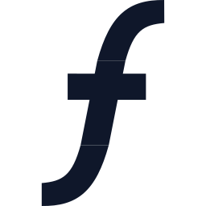

# flowysurf



*flowysurf* is a lightweight visual project manager optimized for planning milestones and tasks with a clean UI. Drag nodes, connect task flows, and track milestone progress — milestones automatically aggregate upstream Task completion. Built with speed and UX in mind.

- 
- 

---

## 🌊 How does it work?

FlowySurf is a visual map editor for designing workflows and milestones. It focuses on making it easy to model task dependencies and track progress across milestones. Key ideas:

- Nodes represent Start, Task, or Milestone elements.
- Edges represent flow/dependency between nodes (one node flows into another).
- Milestones automatically count upstream Task nodes and show completion progress.
- TaskNodes expose a main checkbox that marks the task complete. Subtasks are local and do not count towards milestone completion.

---

## ✨ Features

- Drag & drop nodes
- Create Task and Milestone nodes quickly
- Chain tasks and have Milestones aggregate upstream completion
- Live progress bar on Milestone nodes
- Confetti celebration when a Milestone completes (because milestones deserve celebration)
- Import/export .flowy files; your data is your own

---

## 🎯 Quick usage

1. Open the app (run locally or visit [flowy.surf](https://flowy.surf/)).
2. Add nodes with the bottom right + button (Task / Milestone).
3. Connect nodes by dragging a handle from the source to the target.
4. Use the large checkbox on Task nodes to mark a task complete — Milestones will update automatically.
5. Click a Milestone title to edit it; the steps header will reflect the name.

---

## 🛠 Development

Requirements

- Node.js 16+
- npm or pnpm

Getting started

```bash
# install dependencies
npm install

# start dev server
npm run dev
```
Local storage

The app autosaves state to `localStorage` under the key `flowymap-v1`. Use the UI export/import buttons to move maps between machines.

Project structure (brief)

- `src/pages/Map.jsx` — main editor and React Flow wrapper
- `src/components/nodes/` — custom node components (TaskNode, MilestoneNode, StartNode)
- `src/lib/flowEvents.js` — small emitter used to notify nodes of graph changes

---

Built in a 36-hour sprint for the [HackGT](https://hack.gt) hackathons.